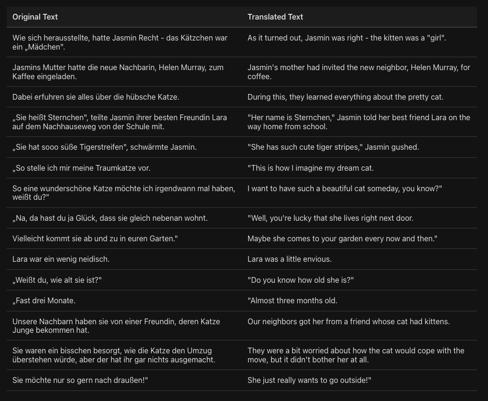

# Book Translator

## [» Click here for the demo «](https://mayorandrew.github.io/book-translator/)

## Overview

Book Translator is a frontend-only application designed to help language learners read books by providing side-by-side translations using the ChatGPT API.

The app features:

- Input area for pasting book text
- Translation via OpenAI's ChatGPT API
- Side-by-side display of the original and translated text
- Streaming responses for instant feedback
- Highlight individual words to get specific translations

Users need to provide their OpenAI API key to use the translation service.

## Technology

This application uses [SolidJS](https://solidjs.com/) and [TypeScript](https://www.typescriptlang.org/).

[IxJS](https://github.com/ReactiveX/IxJS) is used for stream processing.

A good portion of the code was vibe-coded with AI's assitance.

## Development

Use `pnpm` to manage dependencies. [Corepack](https://github.com/nodejs/corepack) is recommended to ensure that a compatible version is used.

### Scripts

#### `npm run dev` or `npm start`

Runs the app in the development mode. 
Open [http://localhost:3000](http://localhost:3000) to view it in the browser.

The page will reload if you make edits. 

#### `npm run build`

Builds the app for production to the `dist` folder. 
It correctly bundles Solid in production mode and optimizes the build for the best performance.

The build is minified and the filenames include the hashes. 
Your app is ready to be deployed!

## Deployment

You can deploy the `dist` folder to any static host provider (netlify, surge, now, etc.)
