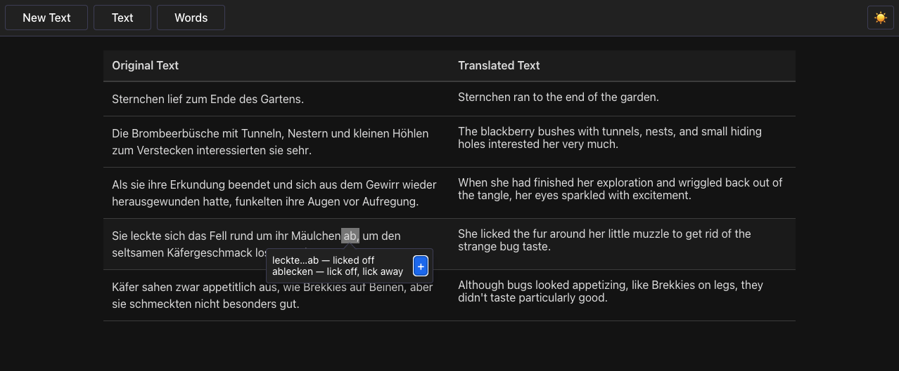

# Book Translator

## [» Click here for the demo «](https://mayorandrew.github.io/book-translator/)

## Overview

Book Translator is a frontend-only application designed to help language learners read books by providing side-by-side translations using the OpenAI API.

The app features:

- Translation via OpenAI API
- Side-by-side display of the original and translated text
- Streaming responses for instant feedback
- Highlight individual words to get specific translations
- Collect unknown words and export in Anki-compatible CSV

Users need to provide their OpenAI API key to use the translation service.

There is also a Demo mode available. In Demo mode, a predefined text is streamed without using OpenAI API.

## Technology

This application uses [SolidJS](https://solidjs.com/) and [TypeScript](https://www.typescriptlang.org/).

[IxJS](https://github.com/ReactiveX/IxJS) is used for stream processing.

A good portion of the code was vibe-coded with AI's assitance.

## Development

Use `pnpm` to manage dependencies. 
[Corepack](https://github.com/nodejs/corepack) is recommended to ensure that a compatible package manager is used.

### Scripts

#### `npm run dev` or `npm start`

Runs the app in the development mode. 
Open [http://localhost:3000](http://localhost:3000) to view it in the browser. 
The page is reloaded when edits are made.

#### `npm run build`

Builds the app for production to the `dist` folder. 
It correctly bundles Solid in production mode and optimizes the build for the best performance. 
The build is minified and the filenames include the hashes.

## Deployment

The project is automatically deployed to GitHub Pages with a GitHub Actions workflow.
